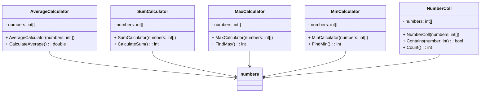

```mermaid
classDiagram
    class AverageCalculator {
        - numbers: int[]
        + AverageCalculator(numbers: int[])
        + CalculateAverage(): double
    }

    class SumCalculator {
        - numbers: int[]
        + SumCalculator(numbers: int[])
        + CalculateSum(): int
    }

    class MaxCalculator {
        - numbers: int[]
        + MaxCalculator(numbers: int[])
        + FindMax(): int
    }

    class MinCalculator {
        - numbers: int[]
        + MinCalculator(numbers: int[])
        + FindMin(): int
    }

    class NumberColl {
        - numbers: int[]
        + NumberColl(numbers: int[])
        + Contains(number: int): bool
        + Count(): int
    }

    AverageCalculator --> numbers
    SumCalculator --> numbers
    MaxCalculator --> numbers
    MinCalculator --> numbers
    NumberColl --> numbers
```
