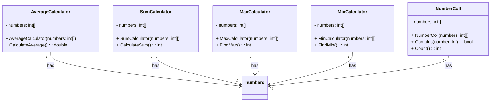

```mermaid
classDiagram
    class AverageCalculator {
        - numbers: int[]
        + AverageCalculator(numbers: int[])
        + CalculateAverage(): double
    }

    class SumCalculator {
        - numbers: int[]
        + SumCalculator(numbers: int[])
        + CalculateSum(): int
    }

    class MaxCalculator {
        - numbers: int[]
        + MaxCalculator(numbers: int[])
        + FindMax(): int
    }

    class MinCalculator {
        - numbers: int[]
        + MinCalculator(numbers: int[])
        + FindMin(): int
    }

    class NumberColl {
        - numbers: int[]
        + NumberColl(numbers: int[])
        + Contains(number: int): bool
        + Count(): int
    }

    AverageCalculator "1" --> "*" numbers : has
    SumCalculator "1" --> "*" numbers : has
    MaxCalculator "1" --> "*" numbers : has
    MinCalculator "1" --> "*" numbers : has
    NumberColl "1" --> "*" numbers : has
```
